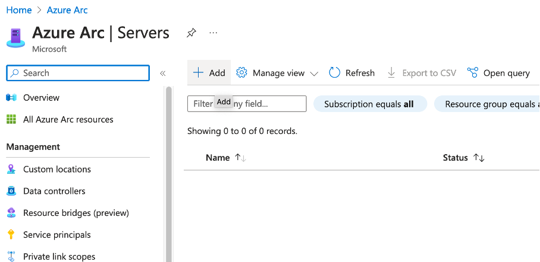
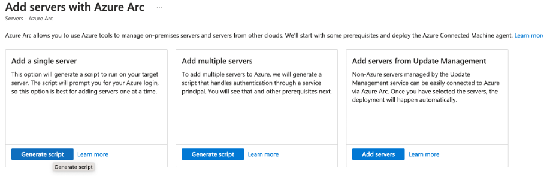
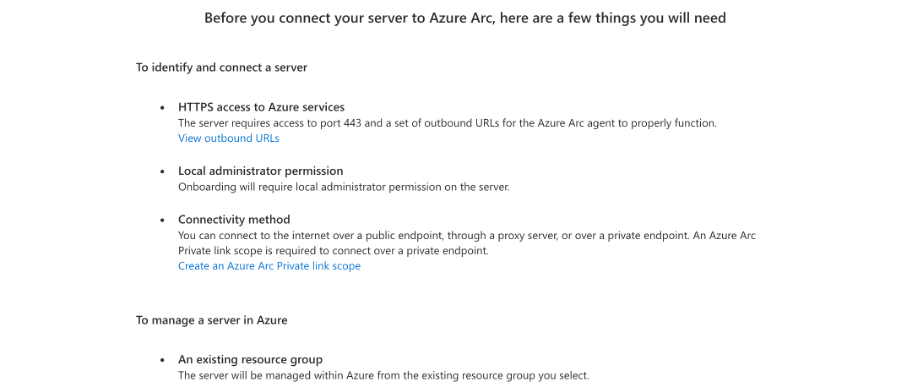
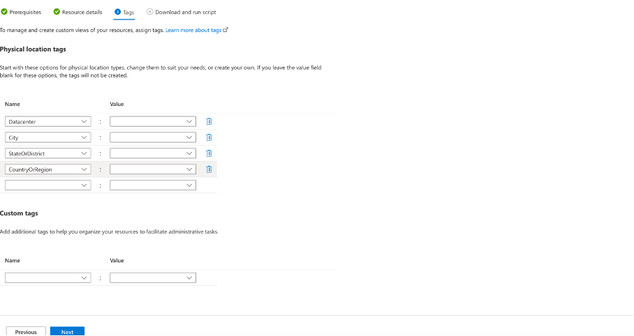
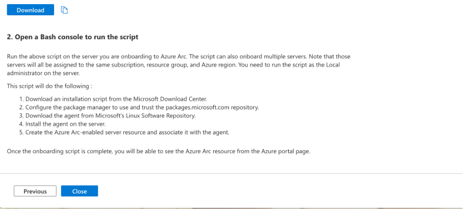

# Rocky Server ins Azure Arc einbinden 

#### Folgende Befehle auf dem Rocky Server ausführen:

**Schritt 1** Updaten

    sudo dnf update

**Schritt** 2 Azure CLI installieren

    sudo dnf install azure-cli

**Schritt** 3 Version überprüfen (muss über 2.7 Version)
    
    az --version 

**Schritt 4** Mit Azure einloggen
    
    az login

#### Folgende Schritte im portal.azure.com ausführen:

**Schritt** 7 In einem Browser portal.azure.com öffnen und anmelden

**Schritt** 8 Über Suchfenster Azure Arc suchen und öffnen

**Schritt** 9 Auf Add klicken

**Schritt 10** Eine der drei hier aufgelisteten Lösungen auswählen, in meinem Fall ist es nur ein Server, weshalb ich Add a single server ausgewählt habe 

**Schritt 11** überprüfen, ob folgende Anforderungen erfüllt sind

**Schritt 12** Subscription, Resource group, Region, Operating system angeben

**Schritt 13** (Optional) Tags setzen 

**Schritt 14** Den angezeigten Skript herunterladen

**Schritt 15** Beschreibung durchlesen

**Schritt 16** Nun gibt es mehrere Möglichkeiten, um die Datei oder den Inhalt der Datei ins Ziel VM zu kopieren. Die einfachste Möglichkeit wäre, dass man die beim Schritt 14 angezeigten Inhalt kopiert, dann im Ziel VM eine Datei erstellt, schliesslich den kopierten Inhalt dort einfügt, die Datei ausführbar macht und schlussentlich die Datei ausführt.

Da ich die VM per Vagrant erstellt habe, nutze ich die Vagrant scp Lösung. Dazu musste ich zuerst vagrant scp lokal auf meinem Gerät installieren. 

Terminal öffnen und folgende Befehl ausführen:

    vagrant plugin install vagrant-scp

**Schritt 17** Die heruntergeladene Datei auf die VM kopieren

    vagrant scp /Users/******/Downloads/OnboardingScript.sh ubuntu2204:/home/vagrant/skript/OnboardingScript.sh

**Schritt 18** überprüfen, ob die Datei auf dem VM ist

    cd /home/vagrant/skript
    ls -la

**Schritt 19** Datei ausführbar machen

    sudo chmod +x OnboardingScript.sh

**Schritt 20** Datei ausführen

    sudo bash OnboardingScript.sh 

