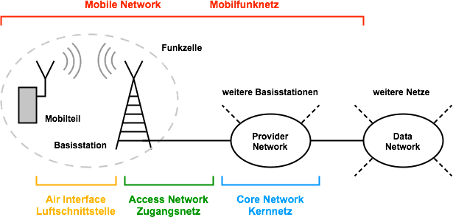

# Was ist Mobilefunknetz?

Das Mobilfunknetz ist die technische Infrastruktur für die Signalübertragung im Mobilfunk. Mobilfunknetze ermöglichen tragbaren Geräten die Kommunikation mit anderen Personen. Hierfür ist keine Kabelverbindung erforderlich. Dabei werden über einen Mobilfunk-Basisstation die Signale in der Luft zum Kunden gebracht, wie beispielsweise über einer Antenne. 

Heutzutage gibt es viele verschiedene Technologien von Mobilfunk-Technologien: 

- GSM
- 3G-Netzwerk
- 4G-Netzwerk
- 5G-Netzwerk

In der Schweiz haben nur drei Mobilfunkanbieter Swisscom, Sunrise und Salt ein eigenes Mobilfunknetz. Alle drei Anbieter verfügen über 3G-Netze, 4G-Netze und 5G-Netze.

Bisher lagen die Frequenzen für das Mobilfunknetz bei weniger als 2,6 Gigahertz (GHz). Für das 5G-Netz geht es nun um Frequenzen von 2 bis 3,8 Gigahertz. Dabei gilt: Je höher die Frequenz, desto geringer die Reichweite. Für das 5G-Netz braucht es daher viel mehr Sendemasten, um dasselbe Gebiet abzudecken.

Viele Sendemasten wurden an Türmen oder auf Dächern montiert. Die neuen 5G-Sendestationen aber lassen sich in kleinen Kästen praktisch überall montieren. Was bedeutet, dass man ihnen viel näherkommt, wenn sie an Laternen, Bushaltestellen oder Wänden montiert werden. 

## Funktion

Mobilfunknetze werden in Funkzellen unterteilt. Jede Funkzelle ist mit einer Basisstation ausgestattet, die aus Sende- und Empfangsstation versorgt wird.

Bei einer Telefongespräch über das Mobiltelefon, kommunizieren nicht beide Handys untereinander. Das Signal wird an die nächste freie Mobilfunkantenne gesendet, wo es per Richtfunk oder Kabel an einen Zentralrechner gegeben wird. Dieser vermittelt das Gespräch in das Netz des Empfängers. Anders gesagt, es leitet die Signale ins Festnetz oder an die Funkzelle, die dem Empfänger am nächsten ist. Diese funkt das Gesprächssignal dann an das Handy des Gesprächspartners.

Der bereits beschriebene Zentralrechner dient immer als Vermittlungsstelle zwischen den Endgeräten. Aus diesem Grund ist er immer über den Standort aller Mobilfunktelefone informiert. Dazu senden Handys, wenn Sie eingeschaltet sind, regelmäßig kurze Statusinformationen. Zudem wählt das Mobiltelefon jederzeit die Basisstation mit dem stärksten Signal aus. Befindet man sich in Bewegung und eine andere Basisstation produziert ein stärkeres Signal als die aktuelle, so loggt sich das Handy bei dieser ein und übernimmt die Kommunikation. Auch so kann ein Rückschluss auf den Standort des Mobiltelefons gezogen werden. 

## Sind 5G Strahlungen gefährlich?

Mobilfunkstrahlungen sind elektromagnetische Strahlungen, welches zur Sorte wie die Mikrowellenstrahlungen gehören. Man geht davon aus, dass die Energie nicht ausreicht, um Erbgut direkt zu beschädigen. Trotzdem kann sie eventuell gesundheitliche Auswirkungen haben.

Wie Mikrowellenstrahlungen versetzen Mobilfunkstrahlungen Wassermoleküle in Schwingungen, welches dazu führt, dass Reibungswärme entsteht und dabei die Temperatur in Gewebe und Zellen steigt. Besonders ist der Bereich betroffen, wo wir mit dem Handy in Berührung kommen. Sobald das Handy sendet und empfängt, dringen die Strahlungen in den Körper ein. Die Frequenz bestimmt auch, wie tief und auch welches Gewebe und welche Zellen möglicherweise beeinflusst werden.

Es wurde bereits mit vielen Menschen, die ein Zusammenhang zwischen Handynutzung und Krebs hatten, untersucht. Einig sind sich dabei die Studien lediglich bei dieser Aussage: dass die Strahlung das Gewebe erwärmt. Dennoch konnte man bis jetzt keinen eindeutigen Beweis finden, die darauf hinweisen, dass durch Mobilfunkstrahlungen Gesundheitliche Schäden entsteht. 

Die US-Wissenschaftler haben für ihre Studie 3000 Mäuse und Ratten zwei Jahre lang Handystrahlung ausgesetzt und das neun Stunden am Tag. Das Ergebnis lautete: Sie fanden tatsächlich einen Zusammenhang zwischen Strahlung und Krebs, zumindest bei männlichen Tieren. Auch die italienischen Wissenschaftler fanden eine erhöhte Anzahl an Hirn- und Herztumoren. Nach dieser Erkenntnis forderten diese Wissenschaftler die Internationale Agentur für Krebsforschung (IARC) auf, die bisherige Einschätzung zum Krebsrisiko durch Handystrahlung zu überdenken.

Mit dem 5G-Netz verteilen sich die Strahlung in den Funkzellen anders. Dabei werden die Signale von der Sendestation Beamforming gesendet. Das heisst, die Signale werden vor allem dorthin geschickt, wo sie benötigt werden, welches einen besonders schnellen und effektiven Datentransfer ermöglicht. Hinzu kommt, dass sich die neuen 5G-Sendestationen näher beim Menschen befinden. Was dazu führt, dass wir mehr Strahlung abbekommen.

Die höchste Strahlenbelastung haben also die aktiven Nutzer, während die anderen weniger abbekommen. 

Tiere wie Vögel und insbesondere auch Insekten können grundsätzlich durch Mobilfunkstrahlung beeinflusst werden. Bienen orientieren sich über das Erdmagnetfeld. Daher können künstlich erzeugte elektromagnetische Felder die Orientierung stören, sodass sie beispielsweise nicht mehr zu ihrem Bienenstock zurückfinden.  
