# Akustik

#### Kalenderwoche 20, 2023

### Schallwellen und Frequenz
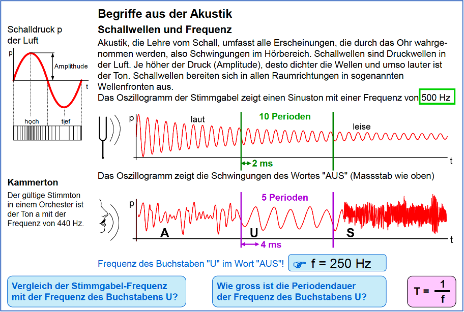

### Tonhöhe und Klang  
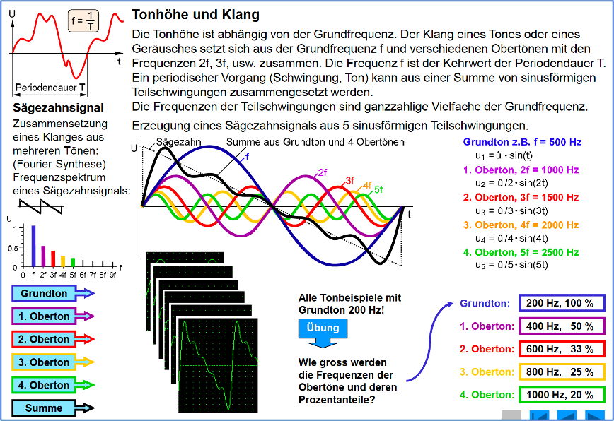

### Rechtecksignal  
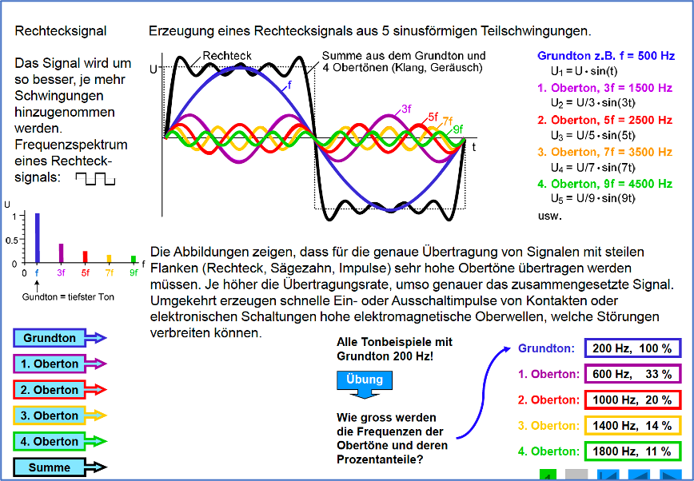

### Hörkurven  
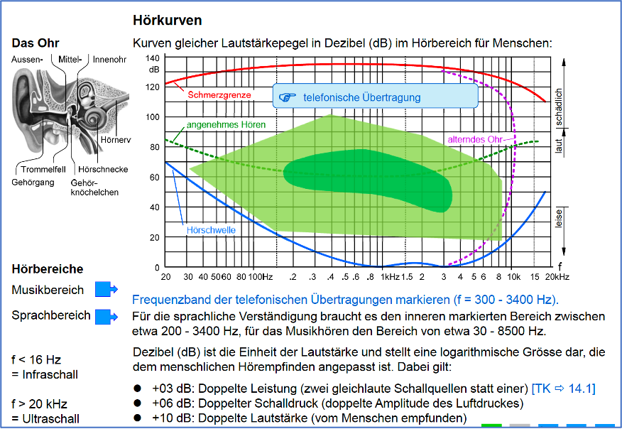

### Lautstärke und Hörschäden 
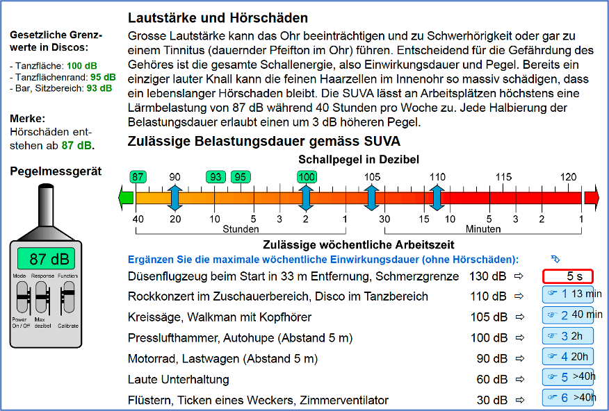

### Schallgeschwindigkeit
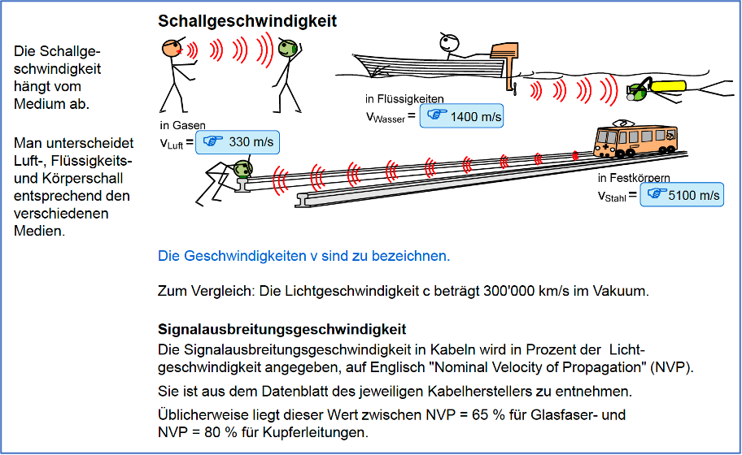

### Telefonische Übertragung 
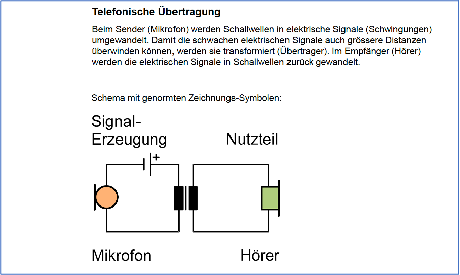

### Hörer, Lautsprecher
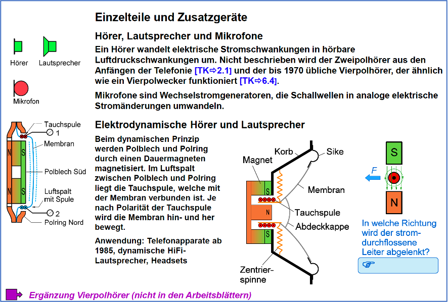

### Piezohörer und Rufwandler  

### Frequenzgang
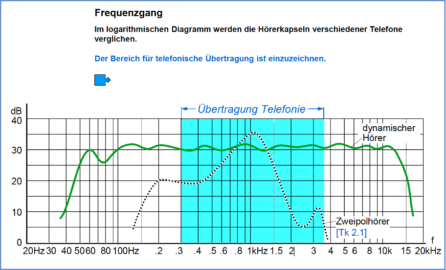

### Hörer  
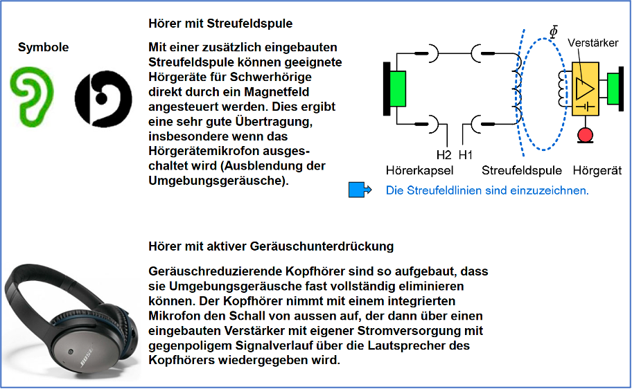

### Stromarten 
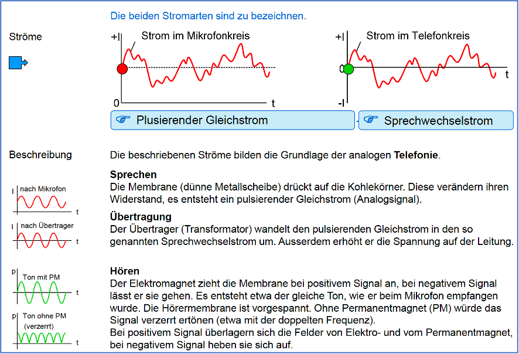

### Amplitudenmodulation
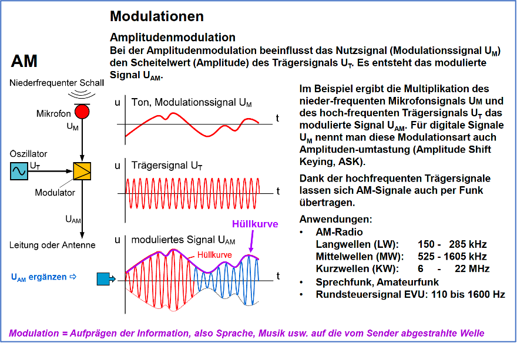

### Demodulation  
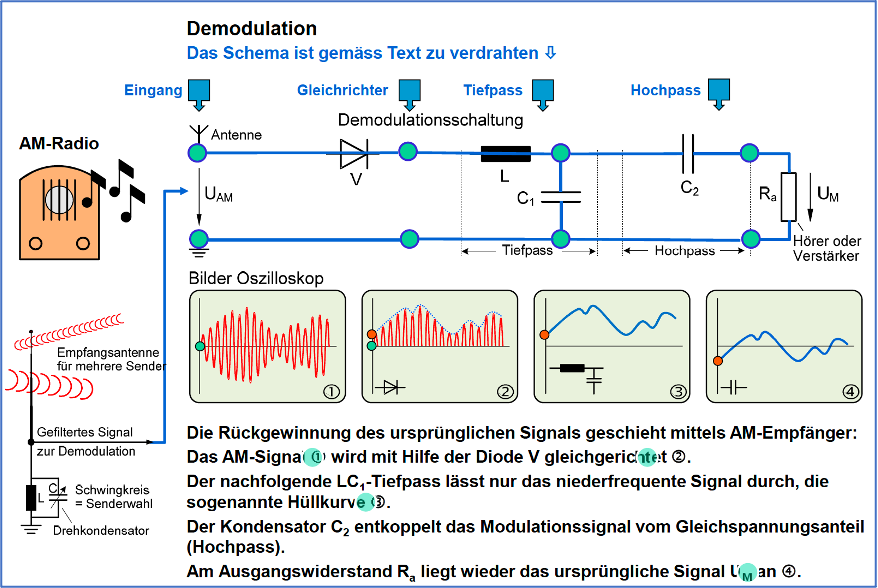

### PCM 
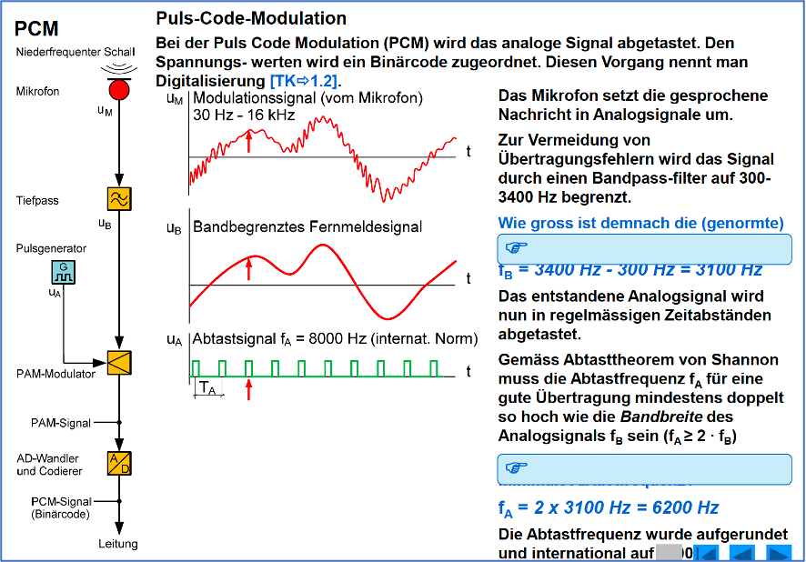

### PAM  
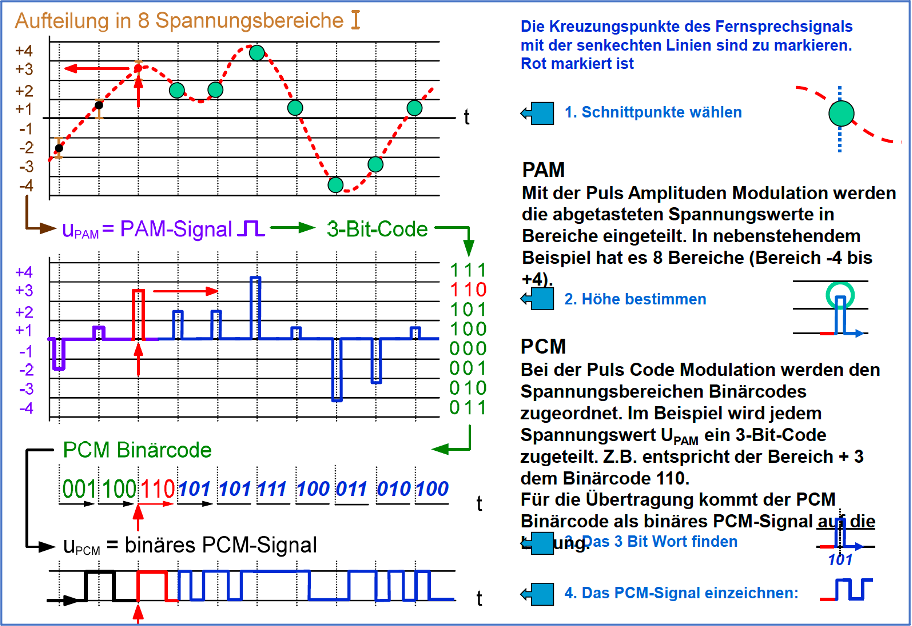
