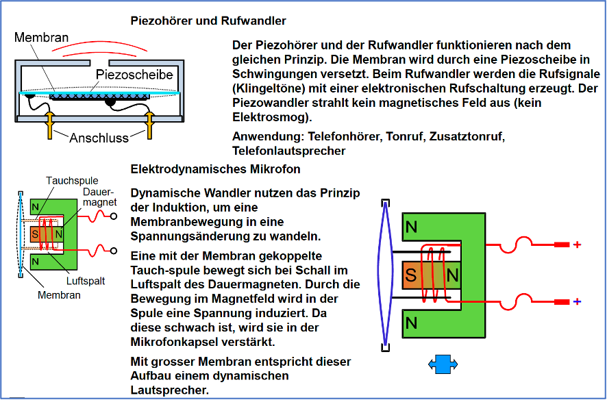

# Akustik

#### Kalenderwoche 20, 2023

### Schallwellen und Frequenz

### Tonhöhe und Klang  

### Rechtecksignal  

### Hörkurven  

### Lautstärke und Hörschäden 

### Schallgeschwindigkeit

### Telefonische Übertragung 

### Hörer, Lautsprecher

### Piezohörer und Rufwandler  

### Frequenzgang

### Hörer  

### Stromarten 

### Amplitudenmodulation

### Demodulation  

### PCM 

### PAM  

