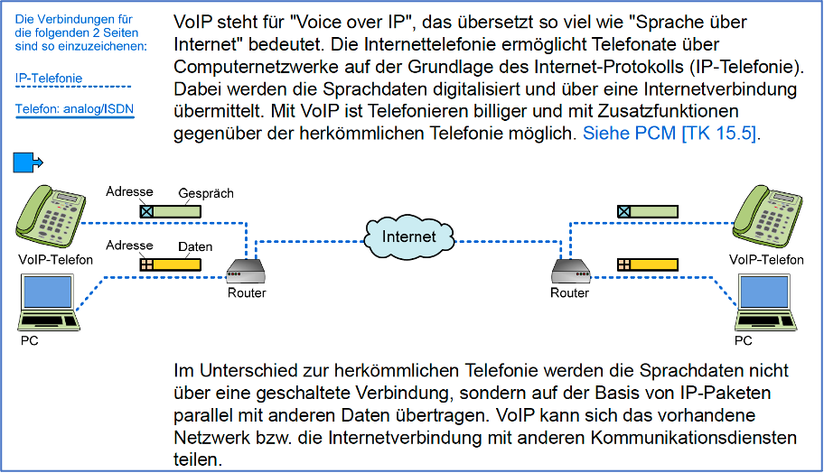
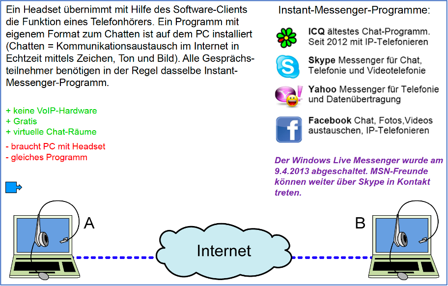
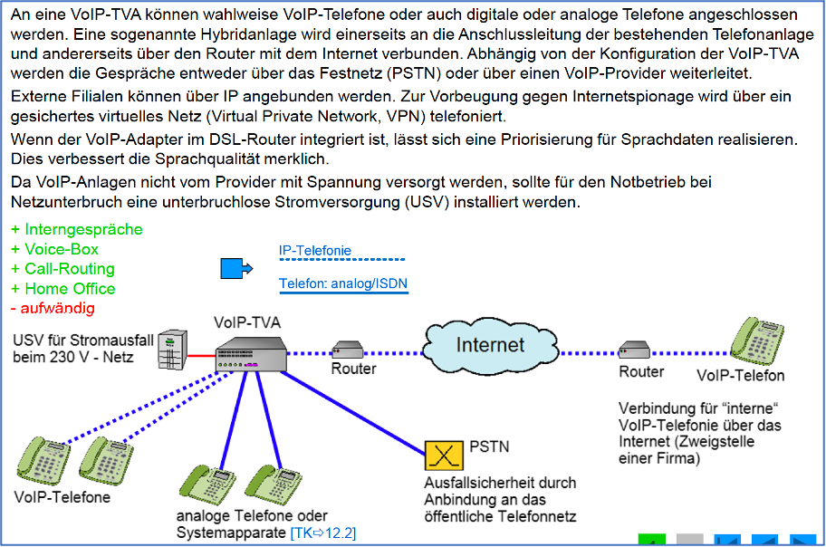
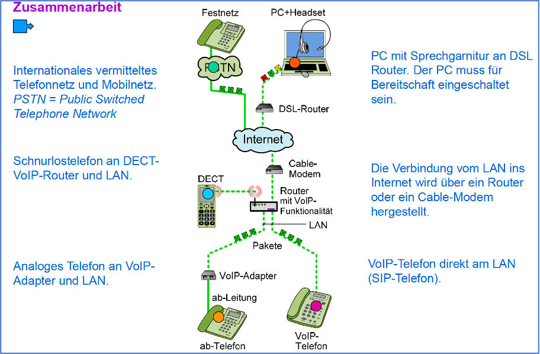
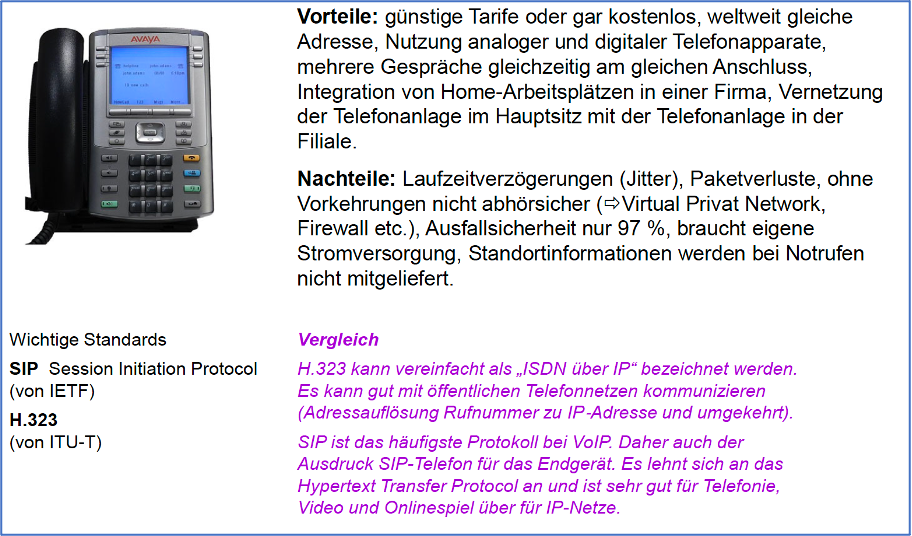
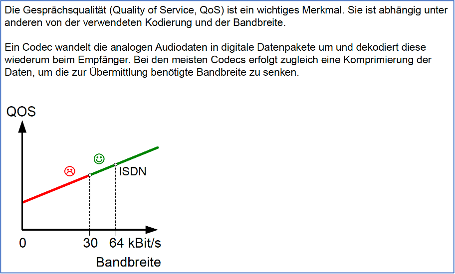
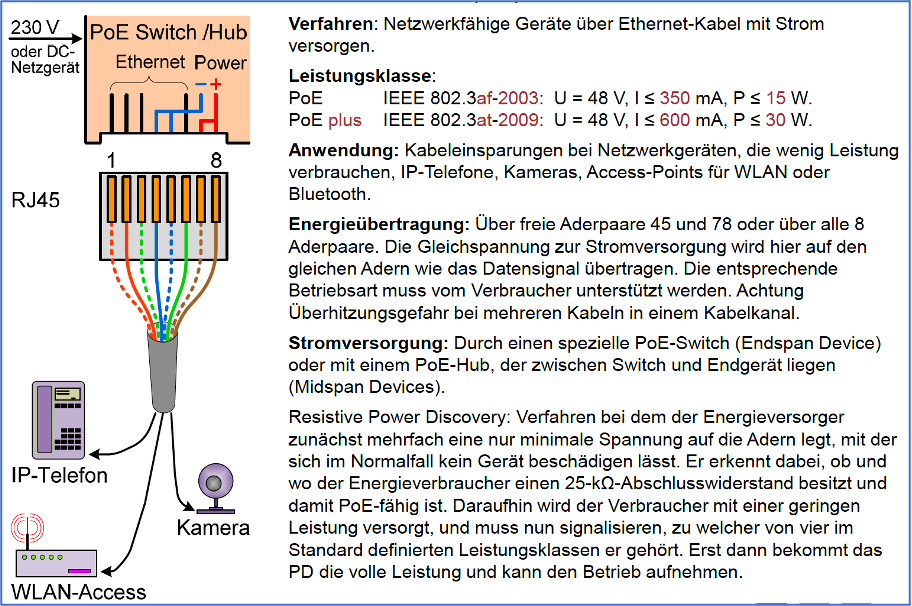

# Breitbandtechnologien

### Voice over IP (VoIP)

### PC zu PC

### VoIP-Telefon

### VoIP-TVA

### Vermittlung

### Verbindungsaufnahme

### VoIP-Zusammenarbeit

### VoIP Vor- und Nachteile

### Quality of Service

### Power over Ethernet (PoE)

