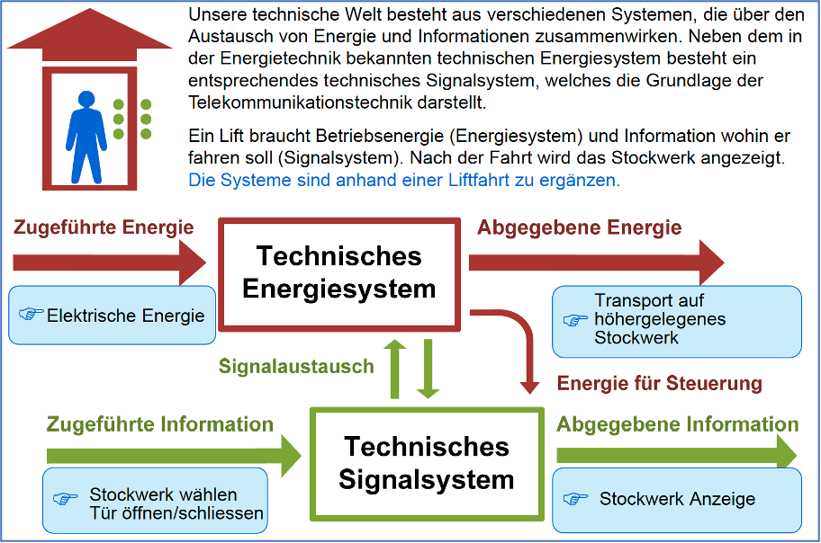
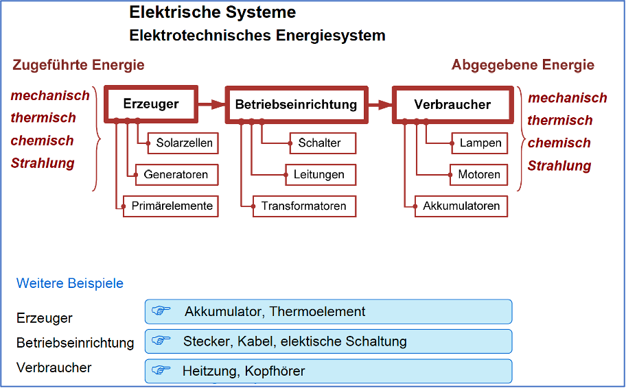
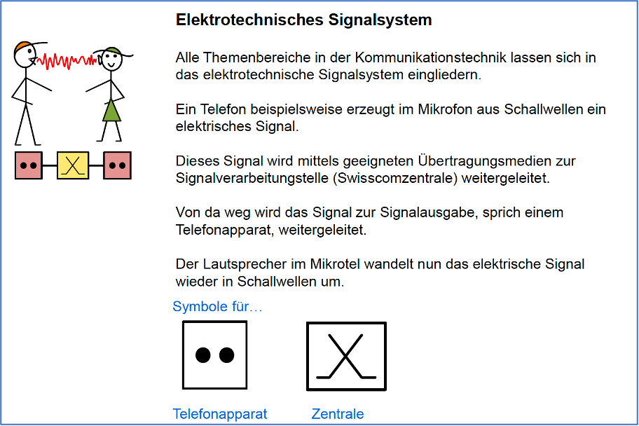
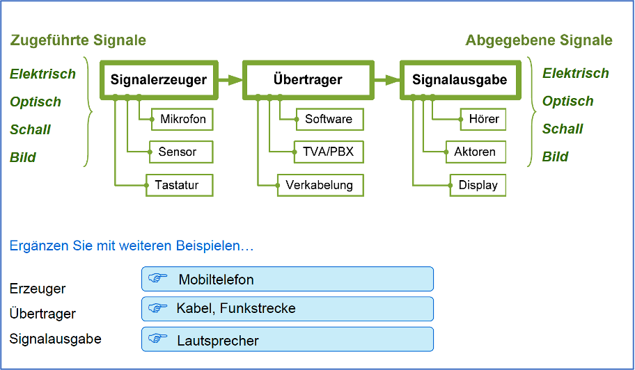
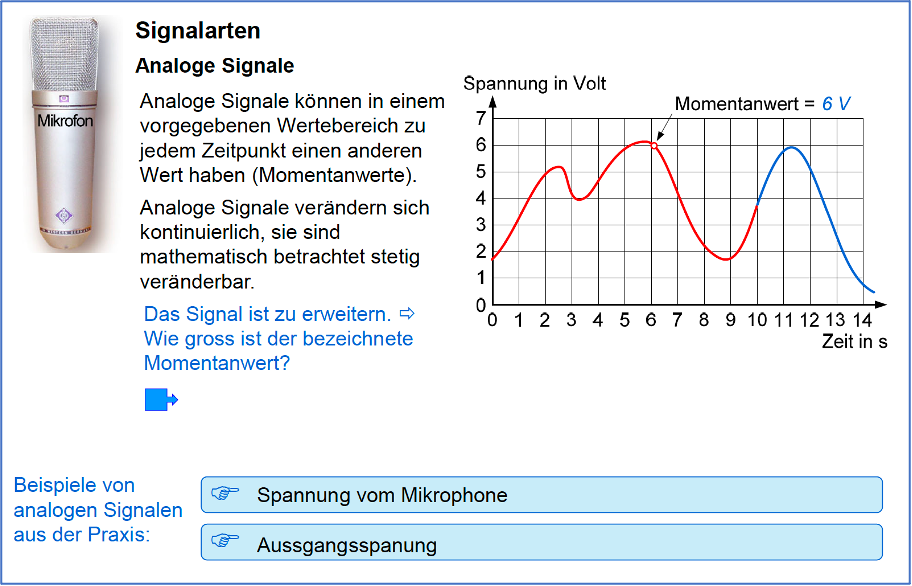
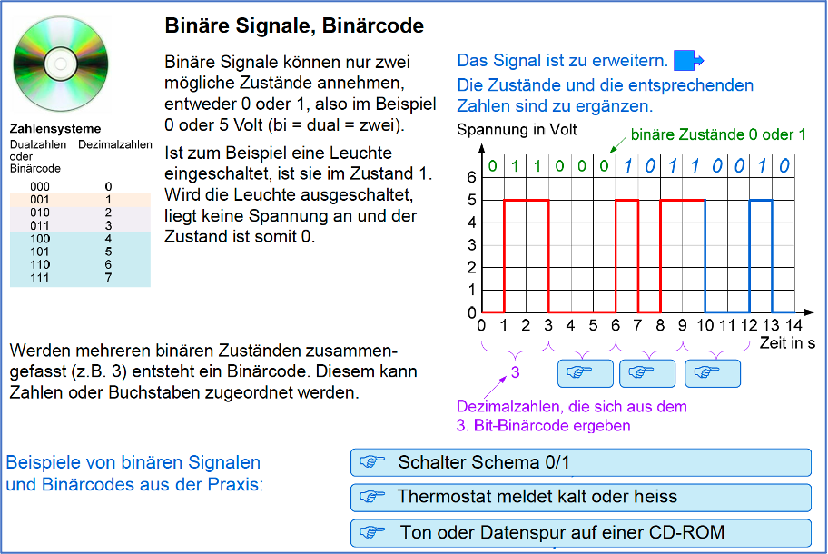
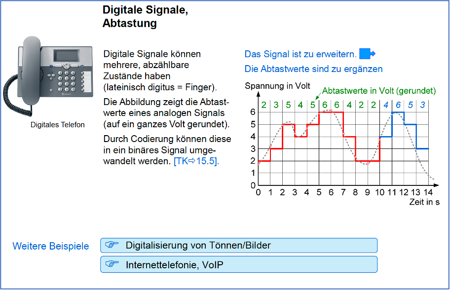
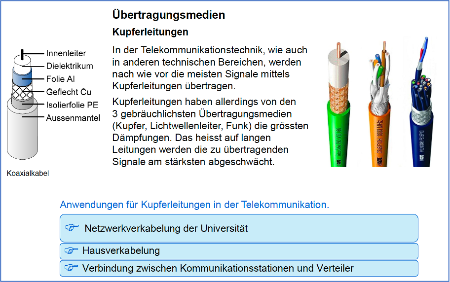
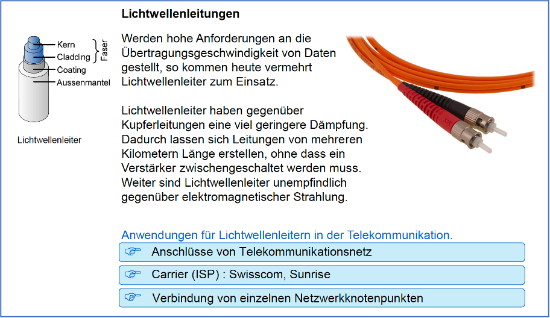
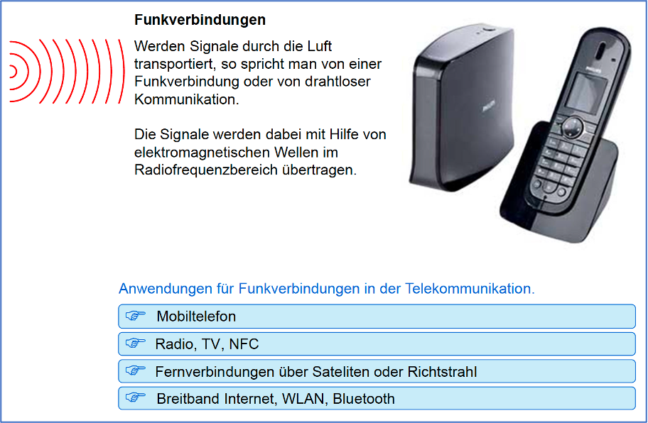

# Grundlagen Telekommunikation

#### Kalenderwoche 19, 2023

## Systemübersicht
### Technische Systeme

### Elektrotechnisches Energiesystem

### Elektrotechnisches Signalsystem

### Analoge Signale

### Binäre Signale, Binärcode

### Digitale Signale

### Kupferleitungen

### Lichtwellenleitungen

### Funkverbindungen

