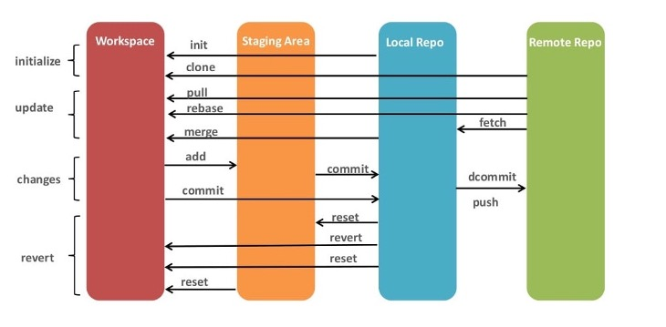

# Git Befehle

    

Benutzer-Handbuch

    man git
Alle Befehle auflisten
    
    git help --all
Alle verfügbaren Befehlsoptionen anzeigen

    git <BEFEHL> -help
Git für den momentan befindenden Ordner initialisieren

    git init
Den Status überprüfen

    git status
Den Status in einer kompakten Form überprüfen

    git status --short
Verlauf der Übertragungen für ein Repository anzeigen

    git log
Die Datei in die Staging-Umgebung hinzufügen und commitbar machen, dabei werden alle Veränderungen verpackt
    
    git add <DATEINAME>
Alle Dateien in die Staging-Umgebung hinzufügen und commitbar machen
    
    - git add .
    - git add -A 
    - git add --all
Erstellen eines Packets mit allen Daten, die verändert wurden, um dies hochzuladen, auso bereit zum Pushen 

    git commit -m "KOMMENTAR/IOFO"
Die verpackten Änderungen hochladen

    git push

Alle Branches auflisten

    git branch
Neue Branch erstellen

    git branch <NAME>
Branch wechseln

    git checkout <BRANCH-NAME>
Branch erstellen und wechseln

    git checkout -b <NEUE-BRANCH-NAME>
Ein Branch erstellen, um Notfälle zu beheben

    git checkout -b emergency-fix	
Datei oder Ordner von der Cloud (Origin) auf einem lokalen Gerät kopieren

    git clone URL
Alle Veränderungen im Cloud (Origin) an die lokale Kopie weiterleiten, aber noch nicht anpassen

	git fetch
Die weitergeleiteten Veränderungen durch den Befehl git fetch in der lokalen Kopie anpassen

    git merge
Verschidene Änderungen einer Datei von den verschiedenen Branches zusammenführen

    git merge branch
Beide Befehle git fetch und git merge zusammen ausführen

    git pull

