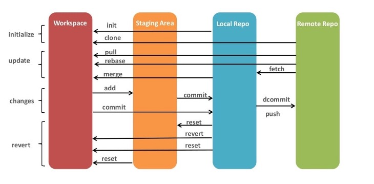

# Git Befehle

Benutzerhandbuch

    man git
Alle Befehle auflisten
    
    git help --all
Alle verfügbaren Befehlsoptionen anzeigen

    git <BEFEHL> --help
Git für den momentan befindenden Ordner initialisieren

    git init
Den Status überprüfen

    git status
Den Status in einer kompakten Form überprüfen

    git status --short
Die Commit-Historie eines Repositorys anzeigen

    git log
Die Datei zur Staging-Umgebung hinzufügen und commitbar machen, dabei werden alle Veränderungen verpackt
    
    git add <DATEINAME>
Alle veränderten oder neuen Dateien zur Staging-Umgebung hinzufügen und commitbar machen
    
    - git add .
    - git add -A 
    - git add --all

Erstellen eines Commits mit allen Änderungen der Staging-Umgebung

    git commit -m "KOMMENTAR/IOFO"
Die lokalen Änderungen im Repository an ein Remote-Repository senden

    git push [BRANCH-NAME] [REMOTE-NAME]

Alle Branches auflisten

    git branch
Neue Branch erstellen

    git branch <NAME>
Branch wechseln

    git checkout <BRANCH-NAME>
Branch erstellen und wechseln

    git checkout -b <NEUE-BRANCH-NAME>
Lokale Kopie eines Repositories von einer URL erstellen. Standardmässig heisst das Remote-Repo lokal dann `origin`

    git clone URL
Alle Veränderungen im Cloud (Origin) an die lokale Kopie weiterleiten, aber noch nicht anpassen

	git fetch
Die weitergeleiteten Veränderungen durch den Befehl git fetch in der lokalen Kopie anpassen

    git merge
Verschiedene Änderungen einer Datei von den verschiedenen Branches zusammenführen

    git merge branch
Beide Befehle git fetch und git merge zusammen ausführen

    git pull

