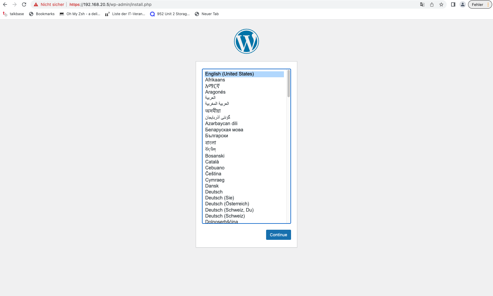
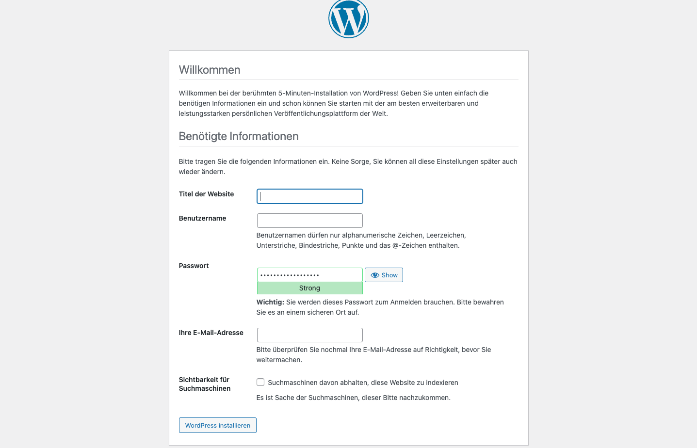
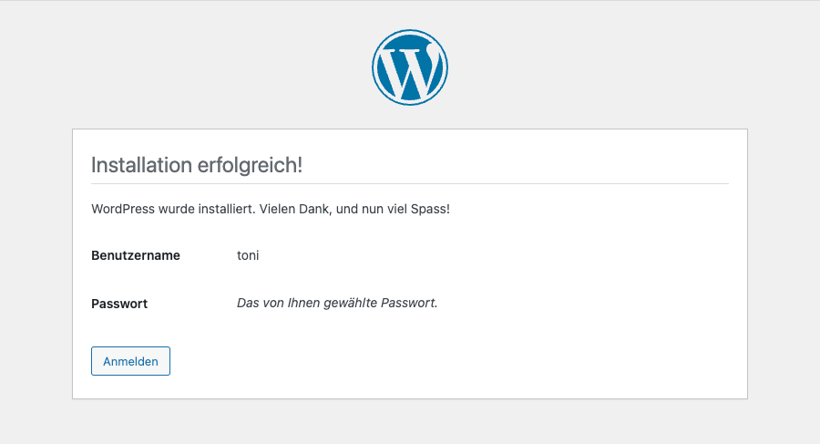
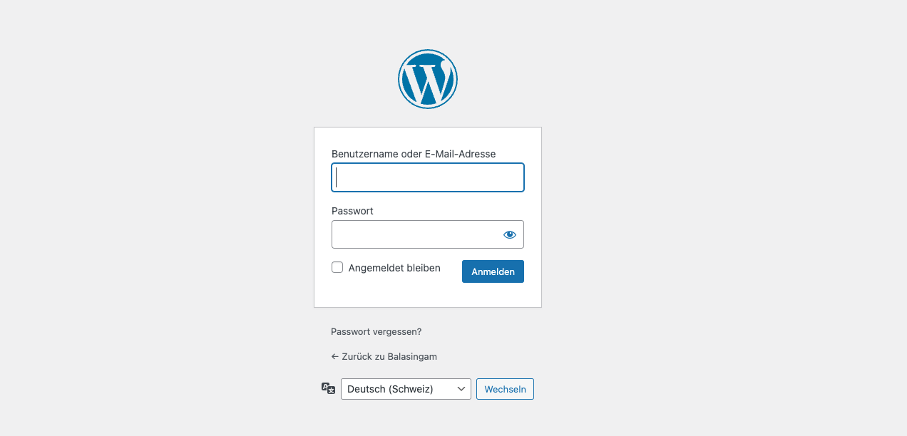
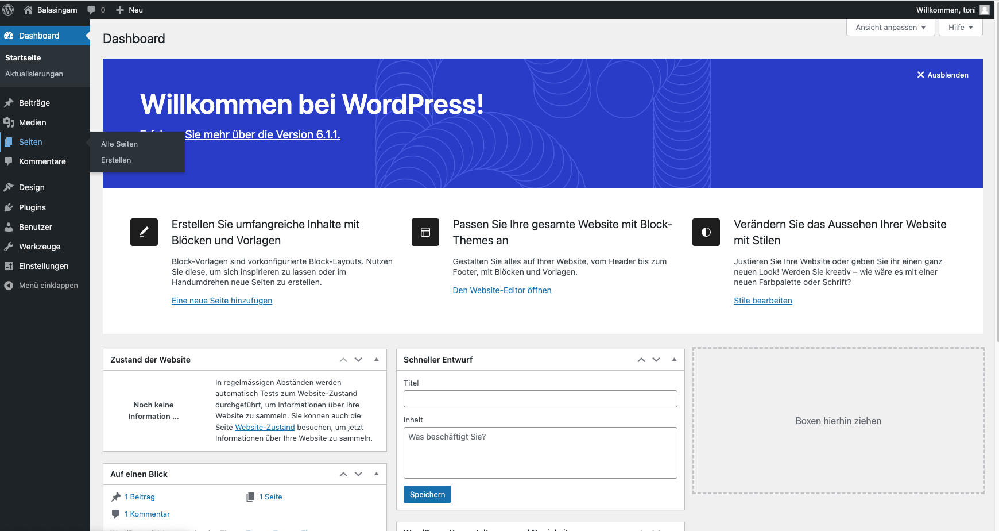

# WordPress auf der Webseite installieren

1. Sprache auswählen

    

2. Benötigte Informationen angeben

    

3. Weiter auf anmelden gehen

    

4. Anmelden

    

5. WordPress Dashboard

    

