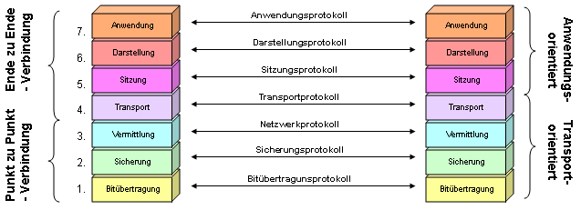
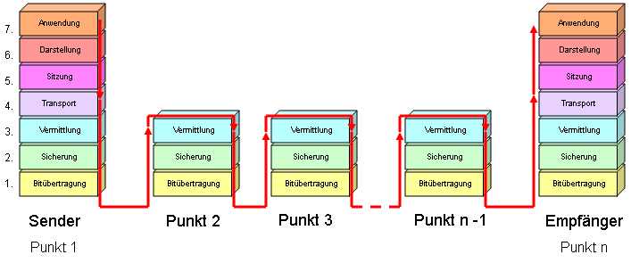

# OSI/ISO Referenzmodell
#### KW6

Das Open Systems Interconnection (OSI)-Modell ist ein Referenzmodell für Netzwerkprotokolle, welches festlegt, wie Netzwerke miteinander kommunizieren und Daten von einem Sender zu einem Empfänger senden und umgekehrt. 
Bei einer Kommunikation zwischen zwei Systemen wird die Kommunikation oder der Datenfluss mindestens zwei Mal alle Schichten durchlaufen. Zuerst wird beim ersten System von Layer 7 bis Layer 1 alle Schichten durchgeführt und dabei ein Paket erstellt. Danach wird das (Bit-)Paket versendet und beim Endsystem wieder entpackt. Dabei werden die Schichten nochmals durchlaufen, aber dies Mal von Layer 1 bis Layer 7, damit es in den ursprünglichen Zustand kommt. 
Die Schichten 1 bis 4 sind die transportorientierten Schichten und die Schichten von 5 bis 7 sind die anwendungsorientierten Schichten des OSI-Modells.

Wenn eine Nachricht von einem PC über ein Netzwerk, z.B. mit Übermittlern wie Switch und Router zu einem PC eines anderen Netzwerkes übertragen wird, dann werden bei den Übermittlern nur die ersten drei Schichten (Layer 1 – Layer 3) angesehen. Wie auf der «Abbildung 1» dargestellt, dienen die ersten drei Schichten nur der Datenübertragung von «Punkt zu Punkt». Die restlichen Schichten (Layer 4 – Layer 7) sind «Ende zu Ende» orientiert. Das bedeutet, dass die «Ende zu Ende» orientierten Schichten erst beim Empfänger-PC erreicht werden. 

###  So laufen die Datenpakete durch die Layer
**Aus dem Internet:**

Das folgende Beispiel ist nur zum Verständnis gedacht, da alle Datenframes immer von unten nach oben – also von Layer 1 nach 7 – erfolgen.
Ein Anwender gibt im Layer 7 über seinen Browser Daten auf einer Webseite ein. Im Layer 6 wird die unabhängige Darstellung der Daten auf das System des Rechners, das der Anwender benutzt, ausgerichtet. Mittels der Sitzungsschicht (Layer 5) werden auf dem Client anwendungsspezifische Protokolle aktiviert, welche die Kommunikation mit dem Webserver ermöglichen. Als Beispiel können hier die Webprotokolle http oder https genannt werden.
Ebenso fällt in diese Schicht die Namensvergabe mittels DNS. Diese Protokolle wiederum leiten die Daten an ihre Ports im Layer 4 weiter. Der Client startet nun mit der entsprechenden Portnummer eine Verbindungsanfrage. In den meisten Fällen wird hierfür das verbindungsorientierte TCP genutzt, das ohne Bestätigung des Empfängers keine Daten versendet. Trift diese ein, wird das TCP des Clients das IP-Protokoll im Layer 3 „aktivieren“. Die IP-Adressen des Clients und des Webservers werden nun „angehängt“. Auf der Schicht 2 wird der IP des Senders dessen Hardware-Adresse hinzugefügt. Letztlich gehen die Daten im Layer 1 auf die „Reise“. Über mehrere Router und andere Stationen landen die Frames beim Webserver. Hier beginnt der Durchlauf der Layer von unten nach oben. Im Layer 7 angekommen, werden die vom Anwender eingegebenen Daten schließlich verarbeitet. 

