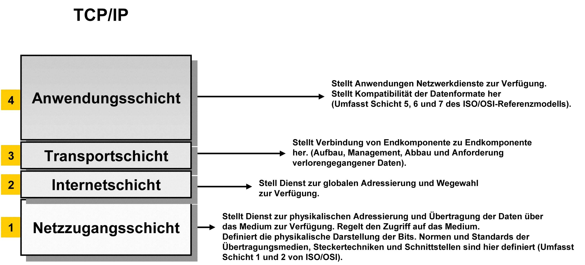

# TCP/IP Referenzmodell

TCP/IP steht für Transmission Control Protocol/Internet Protocol und ist ein Datenübertragungsprotokoll. Genau wie das OSI-Referenzmodell beschreibt das TCP/IP Referenzmodell die Kommunikation zwischen Systemen. Das TCP/IP-Referenzmodell ist die ältere Version, dennoch wird es noch viel genutzt. Auch wenn dieses Modell nur noch 4 Schichten besitzt, bleibt der Ablauf derselbe wie beim OSI-Modell, das heisst bei einer Kommunikation zweier Systeme wird beim Sender von Layer 4 bis Layer 1 alle Schichten durchgeführt. Nach dem Versenden wird das Packet beim Empfänger wieder in den Ursprungszustand gebracht, indem die Schichten von Layer 1 bis Layer 4 durchgeführt werden.

