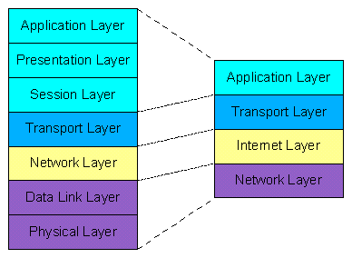
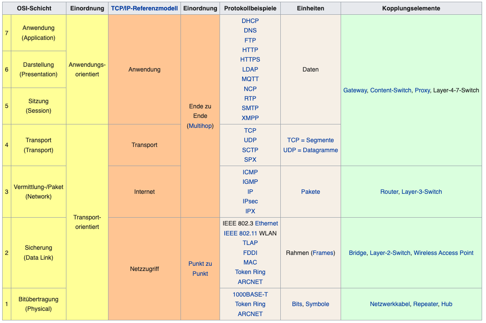

# Unterschied von OSI/ISO & TCP/IP

Die Hauptunterschiede zwischen den beiden Referenzmodellen (OSI und TCP/IP) sind, dass der Application Layer im TCP/IP-Modell den Schichten 5, 6 und 7 des OSI-Modells und der Network Layer in TCP/IP-Modell den Schichten 1 und 2 entsprechen. Weitere Unterschiede sind z.B., dass TCP/IP protokollabhängig und das OSI-Modell protokollunabhängig ist. 

### OSI- und TCP/IP-Referenzmodell mit Beispielen:

